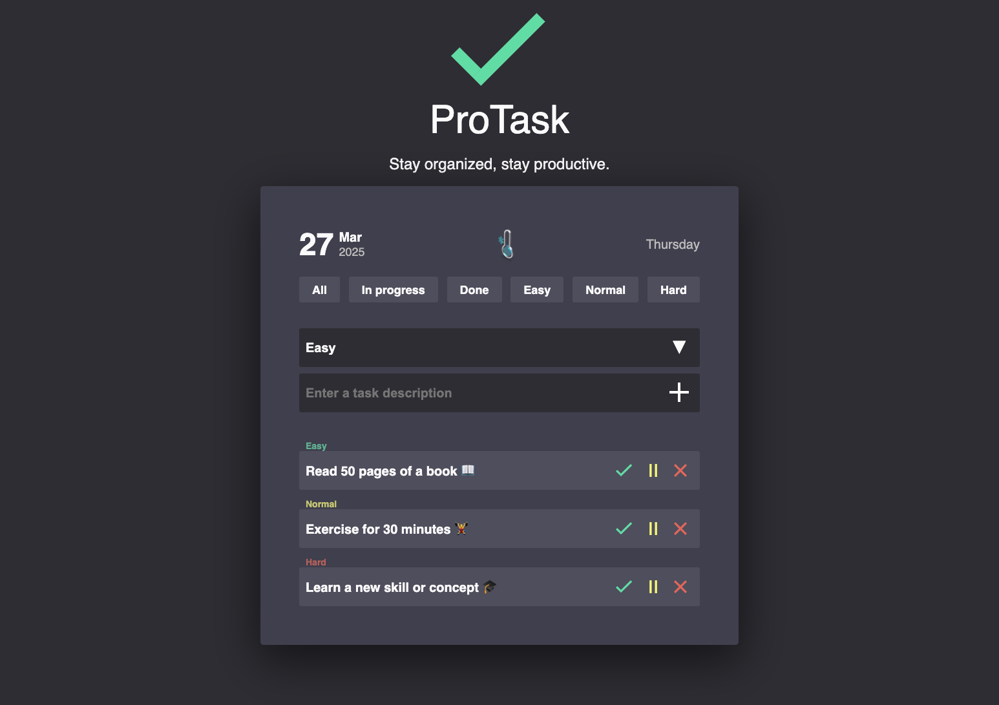

# TODO List



## Опис функціональності

Цей застосунок дозволяє користувачам керувати своїми завданнями за допомогою
зручного списку. Користувач може додавати, редагувати, позначати виконані та
видаляти завдання. Дані зберігаються в локальному сховищі браузера, тому після
перезавантаження сторінки список завдань зберігається.

## Основні можливості

- **Додавання завдань**:

  - Форма містить поле вводу для опису завдання та випадаючий список для вибору
    пріоритету (низький `Easy`, середній `Normal`, високий `Hard`).
  - Після сабміту нове завдання додається до списку.

- **Відображення списку завдань**:

  - Кожне завдання містить:
    - Текст опису.
    - Відображення пріоритетності.
    - Кнопку "Редагувати" ⏸️ , яка відкриває модальне вікно для редагування
      завдання.
    - Кнопку "Виконати", ✅ що позначає завдання завершеним.
    - Кнопку "Видалити", ❌ яка видаляє завдання зі списку.

- **Редагування завдань**:

  - Натискання кнопки "Редагувати" ⏸️ відкриває модальне вікно з формою
    редагування.
  - У формі можна змінити опис та пріоритет завдання.
  - Після збереження зміни відображаються у списку.

- **Зміна статусу завдання**:

  - Після натискання на кнопку "Виконати" ✅ завдання змінює статус на виконане:
    - Текст перекреслюється.

- **Видалення завдань**:

  - Натискання кнопки "Видалити" ❌ повністю прибирає завдання зі списку.

- **Збереження стану**:

  - Усі завдання (разом зі статусом) зберігаються в `localStorage`, що дозволяє
    зберігати їх навіть після перезавантаження сторінки.

- **Сортування завдань**:

  - Додана можливість сортування завдань за статусом, пріоритетом або часом
    додавання.

- **Додаткові можливості**:

- Іконка градусника для погоди:

  - В додаток додано іконку градусника, яка дозволяє користувачам отримувати
    актуальну інформацію про погоду.

  - При натисканні на іконку відкривається модальне вікно з віджетом погоди.

  - У модальному вікні є імпут для пошуку міста, де користувач може ввести назву
    міста для відображення температури.

  - Віджет показує поточну температуру, дату та час.

  - Користувач може перемикатися між шкалою Цельсія та Фаренгейта для перегляду
    температури.

  - Для отримання погодних даних використано API з сайту
    [OpenWeatherMap](https://openweathermap.org/).

## Технології

- HTML
- CSS
- JavaScript (Vanilla JS, `localStorage` для збереження даних)
- OpenWeatherMap API для відображення погоди
- Vite для швидкої розробки

## Деплоймент

- Проєкт задеплоєний на Vercel

## Запуск

1. Склонуйте репозиторій.
2. Встановіть залежності через `npm install`.
3. Запустіть локальний сервер командою `npm run dev`.
4. Відкрийте у браузері `http://localhost:5173/`.
5. Додавайте, редагуйте, позначайте як виконані та видаляйте завдання за
   допомогою інтерфейсу.
6. Використовуйте іконку градусника для перегляду погоди в будь-який час.

Цей застосунок є простою та ефективною реалізацією списку справ, який допоможе
вам організувати свій день, а також дізнатися про актуальні погодні умови!

```bash
├── .gitignore
├── .prettierrc
├── LICENSE
├── README.md
├── SECURITY.md
├── index.html
├── package-lock.json
├── package.json
├── public
    ├── favicon.svg
    └── screenshoot.png
└── src
    ├── css
        └── style.css
    ├── fonts
        ├── helvetica-bold.woff
        ├── helvetica-bold.woff2
        ├── helvetica-medium.woff
        └── helvetica-medium.woff2
    ├── images
        ├── check.svg
        ├── cross.svg
        ├── pause.svg
        ├── plus.svg
        └── weather.png
    └── js
        ├── date.js
        ├── filters.js
        ├── main.js
        ├── markup.js
        ├── modal.js
        ├── popup.js
        ├── storage.js
        ├── tasks.js
        └── weather.js
```
